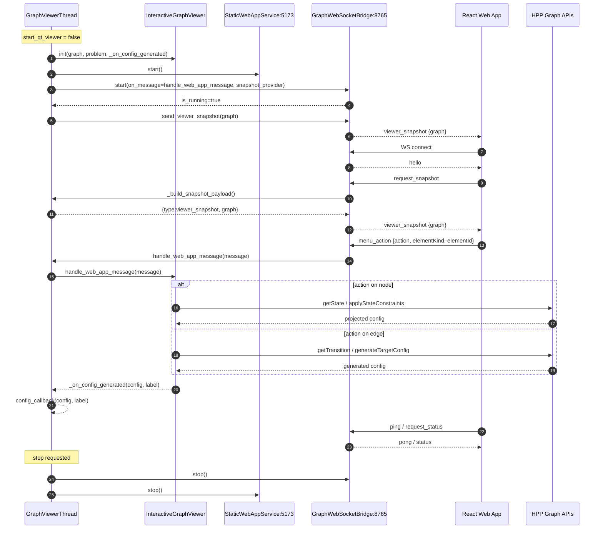

# Web Plot Viewer — Functional Documentation

This document describes the functioning of the web plot viewer component.

---

## 1. General Architecture

---

## 2. Life Cycle

1. `GraphViewerThread.run()` instantiates `InteractiveGraphViewer` with `graph`, `problem`, and a callback `_on_config_generated`.
2. If `start_qt_viewer=True`, the thread calls `self._viewer.show()` and does not start the web app.
3. In web mode:
   - starts an HTTP server serving the web app via `StaticWebAppService.start()`;
   - starts/creates a WebSocket server `GraphWebSocketBridge` that handles communication between Python and JavaScript;
   - immediately sends a snapshot via `send_viewer_snapshot(self.graph)`.
4. The thread stays alive until `stop()` is called and the bridge is no longer running.
5. On stop, `GraphWebSocketBridge.stop()` then `StaticWebAppService.stop()` are called.

---

## 3. Communication

### Messages: Python → UI

| Message | Fields |
|---|---|
| `hello` | `type: hello`, `source: python`, `url: <websocket URL>` |
| `viewer_snapshot` | `type: viewer_snapshot`, `graph: _serialize_graph(graph)` |
| `pong` | Response to `ping` |
| `ack` | Generic response to `menu_action` |
| `status` | Response to `request_status` |

### Messages: UI → Python

| Message | Fields |
|---|---|
| `request_snapshot` | _(no fields)_ |
| `menu_action` | `action`, `elementKind: node \| edge`, `elementId` |
| `ping` | _(no fields)_ |
| `request_status` | _(no fields)_ |

---

## 4. Business Action Routing

Front-end action routing to HPP is handled in `InteractiveGraphViewer.handle_web_app_message`.

**Supported node actions:**
- `generate_random_config`
- `generate_from_current_config`
- `set_target_state`

**Supported edge actions:**
- `extend_current_to_current`
- `extend_current_to_random`

---

## 5. Reference Files

| File | Role |
|---|---|
| `src/pyhpp_plot/graph_viewer_thread.py` | Main thread managing the viewer lifecycle |
| `src/pyhpp_plot/interactive_viewer.py` | Business logic and HPP action dispatch |
| `src/pyhpp_plot/websocket_bridge.py` | WebSocket bridge between Python and the UI |
| `src/pyhpp_plot/web_app_server.py` | Static HTTP server serving the React web app |
